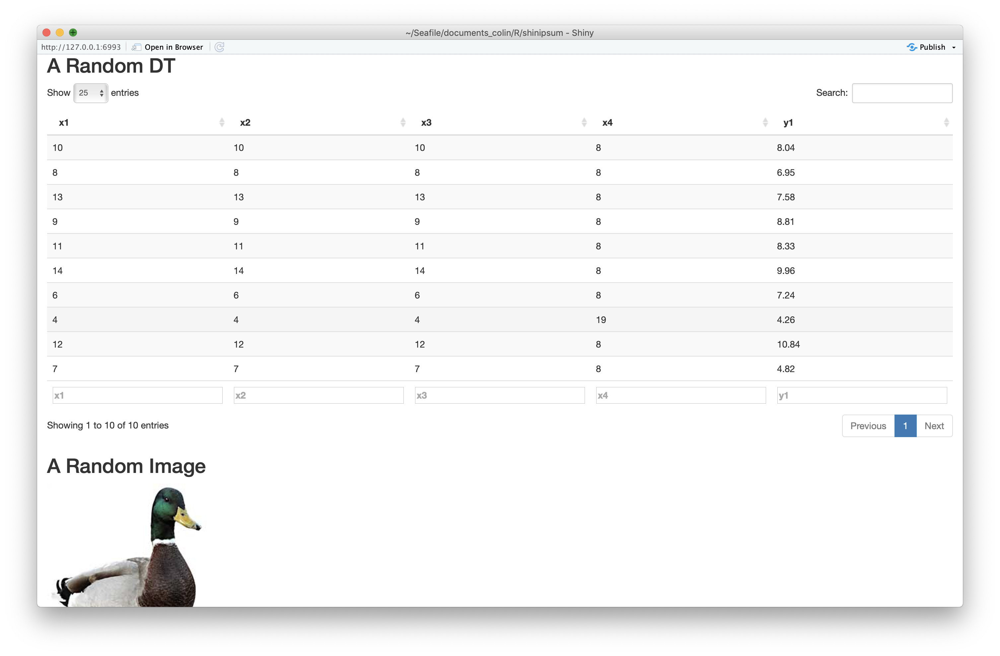

<!-- README.md is generated from README.Rmd. Please edit that file -->

```{r setup, include = FALSE}
knitr::opts_chunk$set(
  collapse = TRUE,
  comment = "#>",
  fig.path = "man/figures/README-",
  out.width = "100%"
)
```
# shinipsum

The goal of shinipsum is to provide random shiny elements for easiest shiny app prototyping, so that you can focus on building the frontend before building the backend.

## Installation

You can install the dev version of shinipsum from GitHub with:

``` r
remotes::install_github("Thinkr-open/shinipsum")
```

## Example

Here is an example of using `{shinipsum}` to generate a random app:

```{r eval = FALSE}
library(shiny)
library(shinipsum)
library(DT)
ui <- fluidPage(
  h2("A Random DT"),
  DTOutput("data_table"),
  h2("A Random Image"),
  plotOutput("image", height = "300px"),
  h2("A Random Plot"),
  plotOutput("plot"),
  h2("A Random Print"),
  verbatimTextOutput("print"),
  h2("A Random Table"),
  tableOutput("table"),
  h2("A Random Text"),
  tableOutput("text")
)

server <- function(input, output, session) {
  output$data_table <- DT::renderDT({
    random_DT(10, 5)
  })
  output$image <- renderImage({
    random_image()
  })
  output$plot <- renderPlot({
    random_ggplot()
  })
  output$print <- renderPrint({
    random_print("model")
  })
  output$table <- renderTable({
    random_table(10, 5)
  })
  output$text <- renderText({
    random_text(nwords = 50)
  })
}
shinyApp(ui, server)

```



Please note that the 'shinipsum' project is released with a [Contributor Code of Conduct](CODE_OF_CONDUCT.md). By contributing to this project, you agree to abide by its terms.
